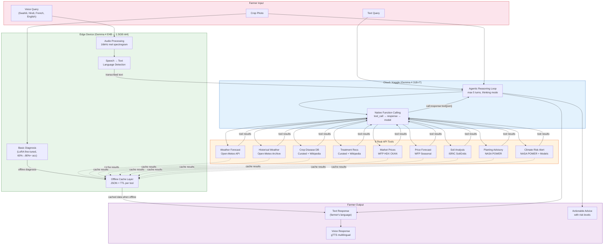

# ClimaSense Architecture

## System Overview (Mermaid)



## Data Flow

```
Farmer speaks Swahili into phone
    │
    ▼
┌──────────────────────┐
│  Gemma 4 E4B (Edge)  │  ← 1.5GB int4, runs on $100 phone
│  Audio → Text         │
│  Language: Swahili    │
└──────────┬───────────┘
           │ transcribed text
           ▼
┌──────────────────────┐
│  Gemma 4 31B (Cloud) │  ← Reasoning engine
│  System: ClimaSense  │
│  Thinking mode: ON   │
│  Tools: 9 available  │
└──────────┬───────────┘
           │ tool calls
           ▼
┌──────────────────────────────────────────────┐
│  Tool Execution (real APIs, no mock data)     │
│                                               │
│  get_weather_forecast(lat, lon)     → Open-Meteo
│  get_commodity_prices(crop, country) → WFP HDX
│  get_soil_analysis(lat, lon)        → ISRIC
│  get_planting_advisory(crop, lat, lon) → NASA POWER
│  diagnose_crop_disease(symptoms)     → DB + Wikipedia
│  ... (4 more tools)                           │
└──────────────────┬───────────────────────────┘
                   │ tool results (JSON)
                   ▼
┌──────────────────────┐
│  31B Synthesizes      │
│  Farmer-friendly      │
│  advice in Swahili    │
└──────────┬───────────┘
           │
           ▼
┌──────────────────────┐
│  gTTS (Swahili)      │  ← Voice response
│  MP3 audio output    │
└──────────────────────┘
```

## Offline Architecture

```
┌─────────────────────────────────────────┐
│           Offline Mode (No Internet)     │
│                                          │
│  ┌──────────┐    ┌──────────────────┐   │
│  │  E4B     │───>│  Offline Cache   │   │
│  │  (local) │    │  JSON + TTL      │   │
│  └──────────┘    │                  │   │
│                  │  Weather: 1hr    │   │
│                  │  Soil: 30 days   │   │
│                  │  Prices: 24hr    │   │
│                  │  Disease: 7 days │   │
│                  └────────┬─────────┘   │
│                           │             │
│                  "Last updated: 3h ago" │
│                  + cached tool results  │
└─────────────────────────────────────────┘
```

## Model Deployment Matrix

| Component | Model | Size | Device | Purpose |
|-----------|-------|------|--------|---------|
| Audio transcription | Gemma 4 E4B | 1.5GB (int4) | Phone/Edge | Voice → text |
| Basic crop diagnosis | Gemma 4 E4B + LoRA | 1.6GB | Phone/Edge | Photo → disease |
| Full reasoning | Gemma 4 31B-IT | ~65GB (bf16) | Cloud GPU | Agentic loop |
| Fallback reasoning | Gemma 4 26B-A4B-IT | ~55GB (bf16) | Cloud GPU | MoE fallback |
